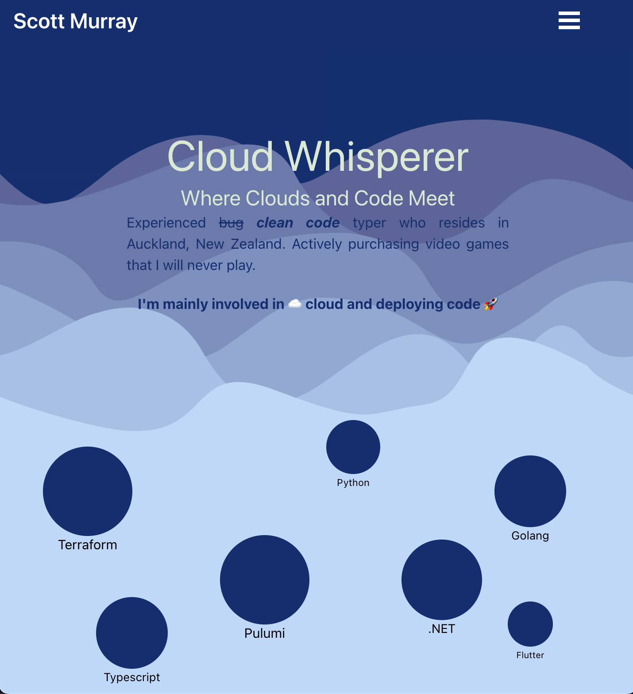

# Personal Website and Blog 🚀

> 🚧 **Work in Progress**: This website is currently under active development. Features and content may change frequently.



## Introduction

Welcome to the repository for my personal website and blog. This platform showcases my portfolio, including projects, skills, experience, and blog posts on various technical topics.

## Installation and Usage

### Prerequisites

- Node.js
- npm

### Installation

1. Clone the repository:

```bash
git clone https://github.com/scott-the-programmer/smkiwi.git
```

2. Navigate to the project directory:

```bash
cd smkiwi
```

3. Install dependencies:

```bash
npm install
```

4. Start the development server:

```bash
npm start
```

The website should now be accessible at `http://localhost:3000`.

## Testing

Tests have been implemented to ensure the reliability of the code. Run the tests with:

```bash
npm test
```

## Contributing

While this is primarily a personal project, contributions for bug fixes or improvements are welcome. Please create an issue to discuss any changes.

## License

This project is licensed under the MIT License. See the [LICENSE](LICENSE) file for details.

## Acknowledgments

Special thanks to all the open-source projects and resources that made this website possible.

---

👨‍💻 Created with ❤️ by Scott Murray
