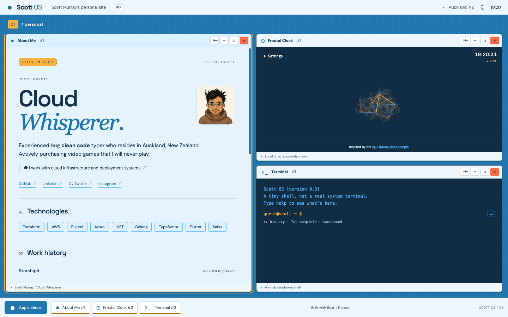

# Scott OS

My personal website, built as a tiling window manager. I wrote it in Rust with [Dioxus](https://dioxuslabs.com), compiled it to WebAssembly, and serve it as static files. There is no backend and no real system access.



## Run it locally

```sh
rustup target add wasm32-unknown-unknown
cargo install trunk --version 0.21.14 --locked
trunk serve
```

Open <http://localhost:8080>. You don't need Node or the Dioxus CLI.

## Apps

Three windows open by default. The rest launch from the Applications menu or the command palette (⌘K or Ctrl+K).

| App | What it does |
| --- | --- |
| About Me | My bio, Auckland location, skills, career history, projects, and social links, carried over from my previous site. |
| Fractal Clock | Animated SVG clock inspired by the [egui sample](https://www.egui.rs/#clock). Settings let you pause it, set depth from 0 to 10, zoom, and change branch length. |
| Terminal | A sandboxed shell with profile commands, history, tab completion, and a small read-only virtual filesystem (`ls`, `cd`, `pwd`, `cat`). It never runs real system commands. |
| Cloud Invoice Simulator | Six toy servers, a traffic slider, and a "go viral" button. A request conveyor animates a FIFO queue while an itemised receipt bills fictional USD compute and request charges. One simulated second passes every 250 ms, and requests time out after 10 simulated seconds. Hidden panes pause. Closing resets. |
| Forward-Backward Lab | Interactive hidden Markov model visualizer using the classic hidden-weather example. Edit the observation sequence and inspect forward, backward, and smoothed posterior probabilities at each step, plus the transition and emission matrices. |

## Window manager

Windows tile into one large master pane and a stacked column of secondary panes. Layout changes animate unless your browser requests reduced motion. Large stacks scroll rather than shrinking panes. On mobile, panes become a vertical stack.

Title bar controls:

- Make master (⇤) moves the pane to the first position.
- Minimize (−) hides the pane and retiles. Its state is preserved.
- Zoom (□) fills the workspace with one pane. Click again to restore.
- Close (×) removes the pane. Temporary state resets when you reopen it.

Every launch creates a new independent instance, even for apps already open. Taskbar buttons in the floating dock at the bottom of the screen restore existing windows instead of duplicating them, and instance numbers match title bars to dock buttons. In the command palette, type to filter, use ↑/↓ to choose, and press Enter to open a new window or switch to an existing one. Escape dismisses menus, the palette, and zoom. The moon button toggles night mode for the whole desktop, including every app, and it follows your OS colour scheme, live, until you press it. Windows, the top bar, the dock, menus, the terminal, and the clock are frosted glass over a hand-drawn SVG wallpaper (day and night variants in `public/`); they turn opaque when the OS asks for reduced transparency. App state resets on reload.

## Checks and production build

```sh
cargo fmt --check
cargo test --locked
cargo clippy --locked --target wasm32-unknown-unknown -- -D warnings
trunk build --release --locked
```

The browser integration tests are optional and need `trunk serve` running in another terminal:

```sh
npm install --prefix /tmp/scott-browser-check playwright
/tmp/scott-browser-check/node_modules/.bin/playwright install chromium
NODE_PATH=/tmp/scott-browser-check/node_modules node tests/browser-smoke.cjs
NODE_PATH=/tmp/scott-browser-check/node_modules node tests/cloud-smoke.cjs
```

Set `BASE_URL` to test another server, or `CHROME_PATH` to use an installed Chrome. Only these tests need Node.

## Deploy

Copy `dist/` to any static host, or package it in the nginx container. The Dockerfile expects `dist/` to exist already:

```sh
trunk build --release --locked
docker build -t scott-os:local .
docker run --rm -p 8080:80 scott-os:local
```

The container serves `/healthz` and includes a health check. The Google Fonts are optional and fall back to system fonts.

### CI and container registry

Pull requests and pushes to `main` run formatting, Rust tests, Clippy, and a release WASM build, then run both browser suites against the production nginx container. When a `main` build passes, CI publishes that same artifact for `linux/amd64`, `linux/arm64`, and `linux/arm/v7`:

- `ghcr.io/scott-the-programmer/smkiwi/smkiwi:latest`
- `ghcr.io/scott-the-programmer/smkiwi/smkiwi:sha-<full-commit-sha>`

GitHub Actions authenticates with its built-in `GITHUB_TOKEN`. Dependabot checks Cargo, Docker, and GitHub Actions weekly. Publishing an image does not deploy it anywhere.

I run the published image on a Raspberry Pi:

```sh
docker pull ghcr.io/scott-the-programmer/smkiwi/smkiwi:latest
docker run -d --name scott-os --restart unless-stopped \
  -p 8080:80 ghcr.io/scott-the-programmer/smkiwi/smkiwi:latest
```

To roll back, pin the commit tag or image digest.

## Source layout

- `src/main.rs` holds the workspace, tiling, launcher, command palette, and window chrome.
- `src/model.rs` holds window state and its unit tests.
- `src/about.rs` holds my personal content from the original React site.
- `src/clock.rs` holds the fractal clock and geometry tests.
- `src/cloud.rs` holds the cloud traffic simulation, fictional billing, and invariant tests.
- `src/forward_backward.rs` holds the hidden Markov model visualizer and algorithm tests.
- `src/toys.rs` holds the sandboxed terminal.
- `desktop.css` holds the responsive workspace styles.
- `public/tile-transitions.js` animates layout transitions.
- `tests/*.cjs` are the Playwright browser smoke tests.

The legacy React site lives in git history. The old `/blog` and `/dog` routes are not implemented.

[MIT License](LICENSE)
